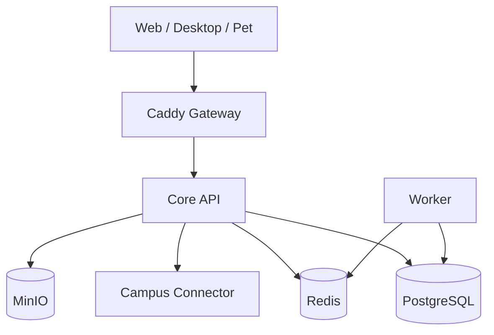

# 架构说明

## 关键决策

### 统一日历模型

课表、个人日程和 DDL 都映射为 `CalendarEvent`，通过 `kind` 与 `source` 区分；作业仍保留 `Task` 聚合，并可关联一个截止事件。这样客户端只维护一套日历渲染协议。

### 番茄钟由客户端计时、服务端记账

浏览器后台节流和断网会使服务端推送式秒表复杂化。开始时服务器签发会话，客户端用单调时钟显示，完成时服务器按 `started_at`、计划时长和容差校验，再发布积分事件。

### 积分采用不可变账本

余额是账本求和，不直接存一个可任意覆盖的数字；未来兑换食物/皮肤以幂等 `reference_id` 写负数流水，便于审计和退款。

### 爬虫是防腐层

校园服务只解析并返回统一 DTO，由核心服务负责去重和写库。每校 connector 独立限流、重试、版本与 fixture，学校页面变化不会污染核心领域。

## 演进顺序

1. MVP：账户、事件、任务、番茄会话、mock connector。
2. 接入首个真实学校、同步游标、通知与重复日程。
3. MinIO 上传与播放授权、积分商城。
4. 桌面端/桌宠；仅在团队规模或负载证明需要时拆分 core 模块。

